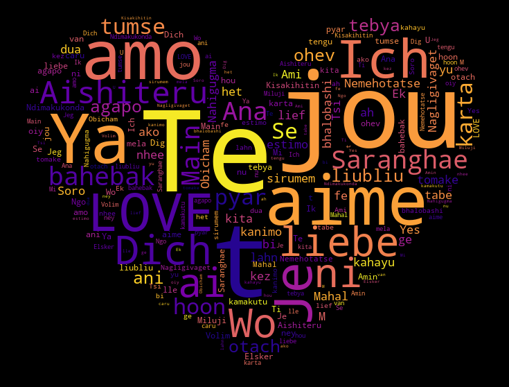
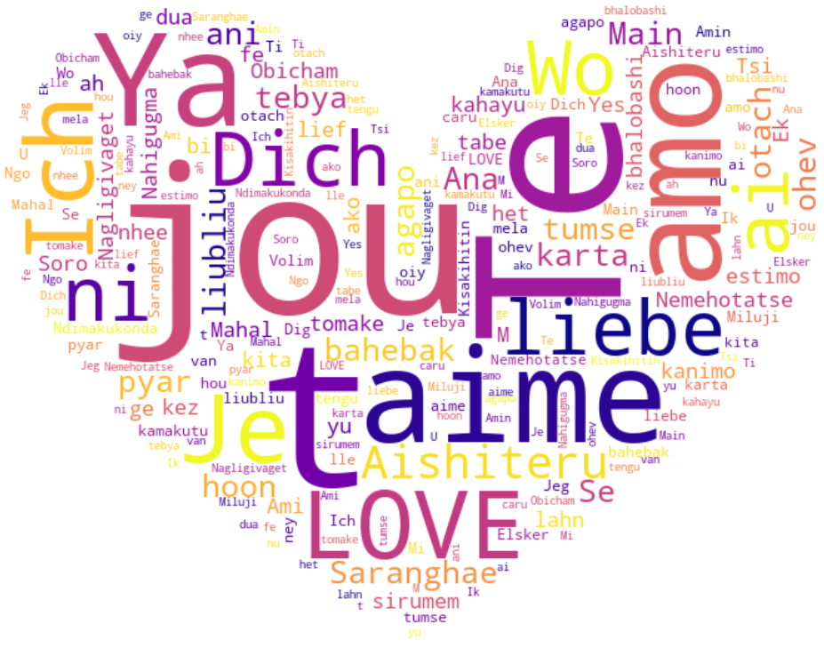

# ** WordCloud **

> Saw these word-clouds on a presentation recently, really peaked my interest so decided to try implementing one myself.
> - Made up of 38 distinct ways to say "I Love You" in various languages and dialects.
> - Used heart shape as the masking
> - Color/Accents can be defined along with the background

> >SAMPLES
> 
> 
> 

## Tags:

- LOVE
- Python
- numpy
- WordCloud
- matplotlib

## To Run

```shell
> python3 love.py
```

